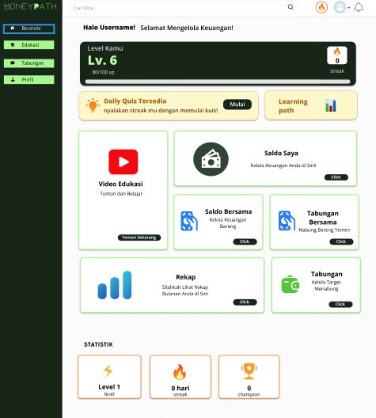

#  Moneypath

<p align="center">
  
  
  
  
  
</p>

> A fullstack finance tracking web app using Firebase + Vercel serverless architecture.

\---

##  Live Demo

*  Deployed Version: [Link Here!](https://moneypath-7777.firebaseapp.com/)


\---

##  Screenshots

###  Dashboard



###  Login


\---

##  Architecture

User → Firebase Hosting → Axios → Vercel API → Database

\---

##  Project Structure

front-end/
├── src/
├── public/
├── .env
├── firebase.json
└── server/
├── controllers/
├── middleware/
├── routes/
├── server.js
├── package.json
└── vercel.json

\---

##  Tech Stack

Frontend: React (Vite), Firebase Hosting, Axios, Tailwind CSS  
Backend: Node.js, Express, Vercel, Firebase Admin SDK  
Auth: Firebase Auth, Firebase Admin SDK  
Database: Firestore

\---

##  Dependencies

### Frontend Dependencies

| Package | Version | Purpose |
|---------|---------|---------|
| **React** | ^19.2.0 | UI library |
| **React DOM** | ^19.2.0 | React DOM binding |
| **React Router DOM** | ^7.13.1 | Client-side routing |
| **Firebase** | ^12.10.0 | Authentication & Firestore |
| **Axios** | ^1.13.6 | HTTP client |
| **Vite** | ^7.3.1 | Build tool & dev server |
| **Tailwind CSS** | ^3.4.4 | Utility-first CSS framework |
| **@mui/material** | ^5.18.0 | Material Design components |
| **@mui/x-charts** | ^7.29.1 | Chart components |
| **Chart.js** | ^4.5.1 | Charting library |
| **React Chart.js 2** | ^5.2.0 | React wrapper for Chart.js |
| **GSAP** | ^3.14.2 | Animation library |
| **Lucide React** | ^1.7.0 | Icon library |
| **Class Variance Authority** | ^0.7.1 | CSS class utilities |
| **clsx** | ^2.1.1 | Conditional classnames |
| **Radix UI** | ^1.4.3 | Unstyled accessible components |
| **Emotion** | ^11.14.0+ | CSS-in-JS library |
| **Tailwind Merge** | ^3.5.0 | Merge Tailwind classes |

### Frontend Dev Dependencies

| Package | Version | Purpose |
|---------|---------|---------|
| **ESLint** | ^9.39.1 | Code linting |
| **@vitejs/plugin-react** | ^5.1.1 | Vite React plugin |
| **Autoprefixer** | ^10.4.27 | CSS vendor prefixer |
| **PostCSS** | ^8.5.8 | CSS processing |

### Backend Dependencies

| Package | Version | Purpose |
|---------|---------|---------|
| **Express** | ^5.2.1 | Web framework |
| **Firebase Admin SDK** | ^13.7.0 | Firebase backend access |
| **CORS** | ^2.8.6 | Cross-origin resource sharing |
| **Resend** | ^6.10.0 | Email service |

\---

##  Getting Started

### Clone

git clone <your-repo>
cd front-end

### Frontend

npm install

Create .env:
VITE\_API\_URL=https://your-backend.vercel.app

Run:
npm run dev

### Backend

cd server
npm install
vercel --prod

\---

## 🔌 API Docs

### POST /auth/register

Request:
{
"email": "user@example.com",
"password": "123456"
}

Response:
{
"message": "User created"
}

### POST /auth/login

Response:
{
"token": "..."
}

### GET /auth/profile

Header:
Authorization: Bearer <token>

Response:
{
"uid": "123",
"email": "user@example.com"
}

\---

##  Deployment

Backend:
cd server
vercel --prod

Frontend:
npm run build
firebase deploy

\---

##  Setup Instructions

### Prerequisites
- Node.js v16+ installed
- Firebase account with Firestore database
- Vercel account (for backend deployment)

### Frontend Setup

1. **Clone the repository:**
```bash
git clone <your-repo-url>
cd Moneypath
```

2. **Install dependencies:**
```bash
npm install
```

3. **Create `.env` file in root directory:**
```env
VITE_FIREBASE_API_KEY=your_firebase_api_key
VITE_FIREBASE_AUTH_DOMAIN=your_firebase_auth_domain
VITE_FIREBASE_PROJECT_ID=your_firebase_project_id
VITE_FIREBASE_STORAGE_BUCKET=your_firebase_storage_bucket
VITE_FIREBASE_MESSAGING_SENDER_ID=your_firebase_messaging_sender_id
VITE_FIREBASE_APP_ID=your_firebase_app_id
VITE_API_URL=http://localhost:3000
```

4. **Run development server:**
```bash
npm run dev
```
Navigate to `http://localhost:5173`

5. **Build for production:**
```bash
npm run build
npm run preview
```

### Backend Setup

1. **Navigate to server directory:**
```bash
cd server
```

2. **Install dependencies:**
```bash
npm install
```

3. **Create `.env` file in server directory:**
```env
FIREBASE_PROJECT_ID=your_project_id
FIREBASE_PRIVATE_KEY=your_private_key
FIREBASE_CLIENT_EMAIL=your_client_email
RESEND_API_KEY=your_resend_api_key
```

4. **Run locally:**
```bash
npm start
```

5. **Deploy to Vercel:**
```bash
vercel --prod
```

\---

##  API Endpoints

### Authentication APIs

#### POST `/auth/register`
Register a new user account.

**Request:**
```json
{
  "email": "user@example.com",
  "password": "securePassword123"
}
```

**Response:**
```json
{
  "message": "User created successfully",
  "uid": "user_id"
}
```

#### POST `/auth/login`
Authenticate user and receive auth token.

**Request:**
```json
{
  "email": "user@example.com",
  "password": "securePassword123"
}
```

**Response:**
```json
{
  "token": "jwt_token_here",
  "uid": "user_id",
  "email": "user@example.com"
}
```

#### GET `/auth/profile`
Get authenticated user profile information.

**Headers:**
```
Authorization: Bearer <jwt_token>
```

**Response:**
```json
{
  "uid": "user_id",
  "email": "user@example.com",
  "displayName": "User Name"
}
```

#### POST `/auth/logout`
Logout user and invalidate token.

**Headers:**
```
Authorization: Bearer <jwt_token>
```

**Response:**
```json
{
  "message": "Logged out successfully"
}
```

### Transaction APIs

#### GET `/transactions`
Get all transactions for authenticated user.

**Headers:**
```
Authorization: Bearer <jwt_token>
```

**Query Parameters:**
- `month` (optional): Filter by month (format: YYYY-MM)
- `type` (optional): Filter by type (income/expense)

**Response:**
```json
{
  "transactions": [
    {
      "id": "trans_id",
      "type": "expense",
      "amount": 50000,
      "category": "food",
      "date": "2024-04-12",
      "description": "Coffee"
    }
  ]
}
```

#### POST `/transactions`
Create a new transaction.

**Headers:**
```
Authorization: Bearer <jwt_token>
Content-Type: application/json
```

**Request:**
```json
{
  "type": "expense",
  "amount": 50000,
  "category": "food",
  "description": "Coffee",
  "date": "2024-04-12"
}
```

**Response:**
```json
{
  "message": "Transaction created",
  "id": "trans_id"
}
```

#### PUT `/transactions/:id`
Update an existing transaction.

**Headers:**
```
Authorization: Bearer <jwt_token>
```

**Request:**
```json
{
  "amount": 75000,
  "description": "Coffee & lunch"
}
```

**Response:**
```json
{
  "message": "Transaction updated"
}
```

#### DELETE `/transactions/:id`
Delete a transaction.

**Headers:**
```
Authorization: Bearer <jwt_token>
```

**Response:**
```json
{
  "message": "Transaction deleted"
}
```

### Reports & Analytics APIs

#### GET `/reports/monthly`
Get monthly financial summary and report.

**Headers:**
```
Authorization: Bearer <jwt_token>
```

**Query Parameters:**
- `month` (required): Format YYYY-MM
- `email` (optional): Send report to email

**Response:**
```json
{
  "month": "2024-04",
  "totalIncome": 5000000,
  "totalExpense": 3000000,
  "balance": 2000000,
  "transactions": []
}
```

#### POST `/reports/send-email`
Send monthly financial report to email.

**Headers:**
```
Authorization: Bearer <jwt_token>
```

**Request:**
```json
{
  "month": "2024-04",
  "email": "user@example.com"
}
```

**Response:**
```json
{
  "message": "Report sent to email"
}
```

### Savings Goals APIs

#### GET `/savings`
Get all savings goals for user.

**Headers:**
```
Authorization: Bearer <jwt_token>
```

**Response:**
```json
{
  "goals": [
    {
      "id": "goal_id",
      "name": "Vacation",
      "targetAmount": 10000000,
      "currentAmount": 5000000,
      "deadline": "2024-12-31"
    }
  ]
}
```

#### POST `/savings`
Create a new savings goal.

**Headers:**
```
Authorization: Bearer <jwt_token>
```

**Request:**
```json
{
  "name": "Vacation",
  "targetAmount": 10000000,
  "deadline": "2024-12-31"
}
```

**Response:**
```json
{
  "message": "Savings goal created",
  "id": "goal_id"
}
```

#### PUT `/savings/:id`
Update a savings goal.

**Headers:**
```
Authorization: Bearer <jwt_token>
```

**Request:**
```json
{
  "currentAmount": 6000000
}
```

**Response:**
```json
{
  "message": "Savings goal updated"
}
```

#### DELETE `/savings/:id`
Delete a savings goal.

**Headers:**
```
Authorization: Bearer <jwt_token>
```

**Response:**
```json
{
  "message": "Savings goal deleted"
}
```

\---

##  Environment Variables

### Frontend (.env)
```env
VITE_FIREBASE_API_KEY=
VITE_FIREBASE_AUTH_DOMAIN=
VITE_FIREBASE_PROJECT_ID=
VITE_FIREBASE_STORAGE_BUCKET=
VITE_FIREBASE_MESSAGING_SENDER_ID=
VITE_FIREBASE_APP_ID=
VITE_API_URL=http://localhost:3000
```

### Backend (server/.env)
```env
FIREBASE_PROJECT_ID=
FIREBASE_PRIVATE_KEY=
FIREBASE_CLIENT_EMAIL=
RESEND_API_KEY=
NODE_ENV=production
```

\---


